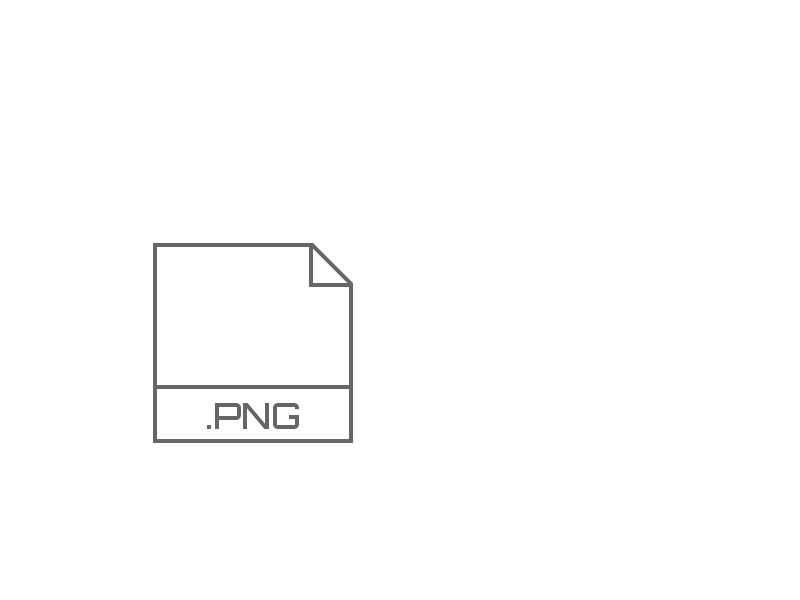

# png-to-ico

[](https://github.com/steambap/png-to-ico/actions?workflow=CI)

> convert png to windows ico format

## Translations
[中文](README_CN.md)

## intro


## install
> npm install --save-dev png-to-ico

## usage
npm script:
```
png-to-ico electron.png > app.ico
```

programming usage:
```JavaScript
const fs = require('fs');
const pngToIco = require('png-to-ico');

pngToIco('electron.png')
  .then(buf => {
    fs.writeFileSync('app.ico', buf);
  })
  .catch(console.error);
```

If you want to control what sizes should be in the icon file, pass an array of files:
```JavaScript
pngToIco(['electron16x16.png', 'electron32x32.png'])
  .then(buf => {
    fs.writeFileSync('app.ico', buf);
  });
```

## Why use png-to-ico?
When I work on an electron project, it's always a nightmare to create ico for windows.  
There're so many options out there like apps that make icon for you, photoshop plugin. But none of them satisfy me.  
I want a JavaScript module that works like the .NET ico tool, which automatically generate different sizes for ico file.  

Based on [jimp](https://github.com/oliver-moran/jimp):
 An image processing library written entirely in JavaScript for Node, with zero external or native dependencies.  
In other words, png-to-ico is written purely in JavaScript, which is great for windows user.  

## license
[MIT](LICENSE)
